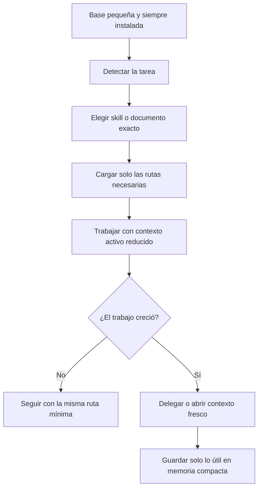

# Estrategia de contexto y capas en Gentle-AI

Este documento explica cómo Gentle-AI evita inflar el contexto cuando carga agentes, skills o reglas de trabajo. La idea no es comprimir todo en un prompt enorme, sino repartir la información en capas y cargar solo lo que hace falta para la tarea concreta.

## Idea central

Gentle-AI no carga todo el conocimiento a la vez. Usa una estrategia de selección:

1. detecta la tarea;
2. identifica la capa mínima que la gobierna;
3. carga solo las piezas necesarias;
4. deja el resto fuera del contexto activo;
5. si la tarea crece, delega o cambia de contexto.

Eso permite mantener personalidad, rigor y flujo de trabajo sin desperdiciar tokens.

## Las capas

### 1. Capa base pequeña y siempre instalada

La base es un bloque mínimo de routing/personalidad que da reglas generales, no todo el conocimiento del sistema.

Qué aporta esa capa:

- orientación general sobre cómo decidir la ruta mínima;
- separación entre revisión y entrega;
- reglas de cuándo preguntar;
- criterios básicos de foco y anti-alucinación;
- recordatorio de que la revisión usa evidencia y no narración.

Qué no intenta hacer:

- no intenta describir todo el repositorio;
- no sustituye a los documentos especializados;
- no mete todas las skills en la memoria activa;
- no convierte al agente en un prompt gigante permanente.

### 2. Índice de skills, no resumen total

El registry no es una versión compactada de todo el conocimiento. Es un índice que dice:

- qué skill existe;
- qué describe;
- en qué ruta está;
- en qué scope vive.

La idea es preservar la fuente de verdad. El registry no reemplaza a los `SKILL.md`; solo indica cuáles leer.

### 3. Carga selectiva por tarea

Cuando una tarea requiere una skill, Gentle-AI no carga el árbol completo de skills. Pasa únicamente las rutas exactas a los archivos que hacen falta, normalmente `SKILL.md` concretos.

Eso significa:

- menos contexto activo;
- menos ruido;
- menos posibilidad de mezclar reglas irrelevantes;
- más fidelidad al propósito original de cada skill.

### 4. Contexto fresco para trabajo fresco

Si el trabajo crece, se vuelve exploratorio o necesita verificación independiente, Gentle-AI prefiere contexto fresco en vez de seguir apilando texto en la misma conversación.

Eso puede significar:

- un subagente separado;
- un worker distinto;
- una fase aislada;
- una nueva lectura focalizada;
- una replanificación breve.

La razón es simple: el contexto largo se contamina, y la contaminación cuesta más que empezar limpio cuando el trabajo ya cambió de tamaño o de forma.

### 5. Memoria compacta

La memoria persistente no guarda transcripciones largas. Guarda notas cortas y estables que funcionen como índice de decisiones.

Sirve para:

- recordar reglas de trabajo repetibles;
- evitar releer convenciones ya establecidas;
- almacenar atajos o límites útiles;
- ahorrar tokens en sesiones futuras.

No sirve para:

- copiar el repositorio completo;
- duplicar documentación extensa;
- guardar ruido de sesión;
- sustituir la fuente de verdad.

## Qué hace en la práctica

Gentle-AI evita inflar contexto con esta secuencia:

1. detecta la tarea;
2. decide qué habilidad o documento exacto necesita;
3. carga solo eso;
4. deja el resto fuera del contexto activo;
5. si el trabajo crece, cambia de contexto o delega.

No comprime todo en un prompt monstruoso. No mezcla todas las reglas en una sola masa. No mantiene en memoria activa documentos enteros si una referencia corta basta.

## Por qué funciona

Esta estrategia funciona porque mantiene separadas tres cosas:

- la base mínima que da identidad y criterio;
- las skills o documentos especializados que aportan detalle;
- la memoria persistente que recuerda decisiones útiles sin repetirlas enteras.

Así el agente conserva personalidad, pero no se ahoga en contexto.

## Qué debe hacer un agente que quiera imitar este comportamiento

- Cargar una base pequeña con reglas generales.
- Resolver la tarea con el ancla más cercana.
- Pedir solo las skills o documentos exactos que correspondan.
- No expandir contexto sin una razón de trabajo real.
- Delegar o reiniciar contexto cuando el problema cambie de tamaño.
- Guardar en memoria solo lo que merezca persistencia.

## Señales de que el contexto ya se está inflando

- Hay demasiadas lecturas sin una hipótesis nueva.
- Se está repitiendo la misma explicación con otras palabras.
- El problema cambió de forma, pero la conversación sigue arrastrando el contexto anterior.
- Se están cargando documentos o skills que no afectan la decisión.
- El agente ya no distingue hecho, inferencia y suposición.

Cuando aparecen esas señales, la mejor salida no es seguir agregando texto. La mejor salida suele ser recortar, delegar o abrir contexto fresco.

## Relación entre capas

## Regla corta

Gentle-AI no intenta meter todo el sistema en el contexto. Intenta meter solo lo necesario para decidir bien.

## Fuentes base

- [README](../README.md)
- [Intended Usage](intended-usage.md)
- [Skill Registry](skill-registry.md)
- [Usage](usage.md)
- [Mental Model](codebase/mental-model.md)
- [agentguidance/routing.go](../internal/components/agentguidance/routing.go)
- [Memory usage and criteria](memory-usage-and-criteria.md)
